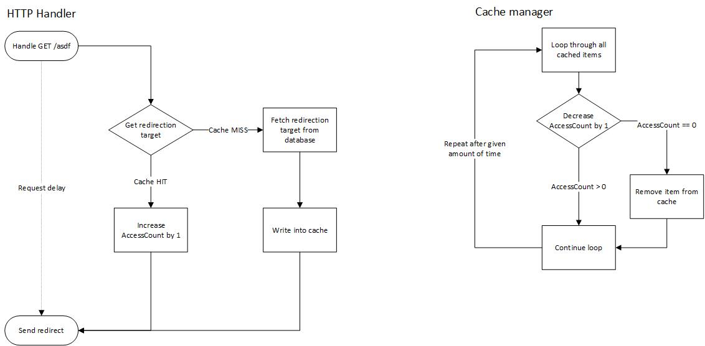

# shortcut

Shortcut is an URL Shortener written in Go. It's fully featured with a JSON API and an in-memory cache.

## Benchmark

For an URL Shortener it's very important to satisfy as most request per seconds as possible.
Therefore, a benchmark is conducted.
I am measuring the speed of shortcut with `wrk 4.1.0` in a VMWare Workstation 15 virtual machine.
In order to find out what slows down the application, various approaches were pursued.

|             | Host                    | Virtual Machine               |
| ----------- | ----------------------- | ----------------------------- |
| OS          | Windows 10 (1803)       | Fedora 29 (Linux 4.20)        |
| CPU         | Intel i7-7500 Dual Core | Intel i7-7500 Dual Core       |
| Memory      | 16GB                    | 4GB                           |
| Go version  |                         | go 1.12 linux/amd64           |
| Database    |                         | MySQL 8.0.15 Community Server |


#### Original
The original application writes every request to the database (logging table). Furthermore, any request is logged on stdout.
This code uses UUID as primary keys.

```bash
$ wrk -c 256 -d 5s -t 48 http://localhost:9999/asdf
Running 5s test @ http://localhost:9999/asdf
  48 threads and 256 connections
  Thread Stats   Avg      Stdev     Max   +/- Stdev
    Latency   244.27ms   44.09ms 364.56ms   81.33%
    Req/Sec    20.47      9.14    50.00     43.73%
  4827 requests in 5.10s, 735.36KB read
Requests/sec:    946.24
Transfer/sec:    144.15KB
```

#### No DB writes
After turning off the writes to the database, the performance is increased by around 3,5 times.
```
$ wrk -c 256 -d 5s -t 48 http://localhost:9999/asdf
Running 5s test @ http://localhost:9999/asdf
  48 threads and 256 connections
  Thread Stats   Avg      Stdev     Max   +/- Stdev
    Latency   145.37ms  239.99ms   1.92s    89.23%
    Req/Sec    70.07     36.56   230.00     66.12%
  16859 requests in 5.10s, 2.51MB read
  Socket errors: connect 0, read 0, write 0, timeout 5
Requests/sec:   3307.07
Transfer/sec:    503.81KB
```

#### No DB writes and no Stdout logging
The below benchmark shows the performance when the logging to Stdout is disabled.
In addition, no database writes took place.
Shortcut can now serve more than 5500 requests per second, or 2000 more than with request logging.
It's about 5 times as fast as the original version.
```bash
$ wrk -c 256 -d 5s -t 48 http://localhost:9999/asdf
Running 5s test @ http://localhost:9999/asdf
  48 threads and 256 connections
  Thread Stats   Avg      Stdev     Max   +/- Stdev
    Latency    94.73ms  166.54ms   1.47s    89.81%
    Req/Sec   119.01     55.01   580.00     70.32%
  28520 requests in 5.10s, 4.24MB read
Requests/sec:   5592.40
Transfer/sec:    851.97KB
```

#### Turn off additional middlewares
There is an additional middleware in place, which sets the correct HTTP headers in POST requests.
Disabling this does not really affect the performance.
```bash
$ wrk -c 256 -d 5s -t 48 http://localhost:9999/asdf
Running 5s test @ http://localhost:9999/asdf
  48 threads and 256 connections
  Thread Stats   Avg      Stdev     Max   +/- Stdev
    Latency    93.29ms  174.71ms   1.74s    91.20%
    Req/Sec   117.97     49.61   290.00     68.20%
  28607 requests in 5.10s, 6.44MB read
Requests/sec:   5609.12
Transfer/sec:      1.26MB
```

#### Integer primary keys
The original version of shortcut uses UUID primary keys.
The benchmark below shows the performance difference with INT auto increment keys.
It's using ordinary 32bit keys (`INT`), which increases the performance by 15% (to original version).
```bash
$ wrk -c 256 -d 5s -t 48 http://localhost:9999/asdf
Running 5s test @ http://localhost:9999/asdf
  48 threads and 256 connections
  Thread Stats   Avg      Stdev     Max   +/- Stdev
    Latency   213.82ms   33.56ms 344.21ms   85.51%
    Req/Sec    23.24      9.23    50.00     69.73%
  5604 requests in 5.10s, 853.73KB read
Requests/sec:   1098.87
Transfer/sec:    167.41KB
```

#### Integer primary keys - no DB writes
With 32bit integer keys and no writes to the database, the performance is merely the same as with UUID keys.
This shows, that UUID keys take longer to write into the tables (more data).
```bash
$ wrk -c 256 -d 5s -t 48 http://localhost:9999/asdf
Running 5s test @ http://localhost:9999/asdf
  48 threads and 256 connections
  Thread Stats   Avg      Stdev     Max   +/- Stdev
    Latency   142.05ms  226.85ms   1.71s    88.93%
    Req/Sec    70.76     36.25   240.00     65.88%
  16908 requests in 5.10s, 2.52MB read
  Socket errors: connect 0, read 0, write 0, timeout 6
Requests/sec:   3315.60
Transfer/sec:    505.11KB
```

#### Big integer primary keys
Utilizing 64bit integer (`BIGING`), the application is 7% faster than the original one.
```bash
$ wrk -c 256 -d 5s -t 48 http://localhost:9999/asdf
Running 5s test @ http://localhost:9999/asdf
  48 threads and 256 connections
  Thread Stats   Avg      Stdev     Max   +/- Stdev
    Latency   230.42ms   45.04ms 355.42ms   78.07%
    Req/Sec    21.76     10.17    70.00     58.99%
  5171 requests in 5.10s, 787.77KB read
Requests/sec:   1014.14
Transfer/sec:    154.50KB
```

#### Big integer primary keys - no DB writes
Without writing the logs to the database, the performance is again just the same.
```bash
$ wrk -c 256 -d 5s -t 48 http://localhost:9999/asdf
Running 5s test @ http://localhost:9999/asdf
  48 threads and 256 connections
  Thread Stats   Avg      Stdev     Max   +/- Stdev
    Latency   132.12ms  223.68ms   1.89s    90.54%
    Req/Sec    69.41     34.58   212.00     68.95%
  16715 requests in 5.10s, 2.49MB read
  Socket errors: connect 0, read 0, write 0, timeout 21
Requests/sec:   3278.92
Transfer/sec:    499.52KB
```

#### Big integer primary keys - no DB writes and no Stdout logging
Disabling the request logger changes nothing. This again shows,
that only the writes to the database slow down the application.
```bash
$ wrk -c 256 -d 5s -t 48 http://localhost:9999/asdf
Running 5s test @ http://localhost:9999/asdf
  48 threads and 256 connections
  Thread Stats   Avg      Stdev     Max   +/- Stdev
    Latency    81.29ms  132.48ms   1.22s    89.46%
    Req/Sec   124.34     52.48   340.00     66.36%
  29950 requests in 5.10s, 4.46MB read
Requests/sec:   5873.59
Transfer/sec:      0.87MB
```

### Caching
In order to further increase the performance, I've written an in-memory cache,
which works like the following diagram outlines.



#### Cache - naive approach 
The below benchmark shows the performance with just the cache enabled.
The database writes and writes to Stdout are enabled, therefore, does not affect the performance.
```bash
$ wrk -c 256 -d 5s -t 48 http://localhost:9999/asdf
Running 5s test @ http://localhost:9999/asdf
  48 threads and 256 connections
  Thread Stats   Avg      Stdev     Max   +/- Stdev
    Latency   276.82ms   57.93ms 360.83ms   80.76%
    Req/Sec    19.20      9.99   111.00     78.90%
  4282 requests in 5.10s, 652.34KB read
Requests/sec:    839.43
Transfer/sec:    127.88KB
```

#### Cache - no DB writes
The following benchmark shows the performance without database writes.
Request logging to Stdout is enabled. It's 13 (!) times faster than the original version.
```bash
$ wrk -c 256 -d 5s -t 48 http://localhost:9999/asdf
Running 5s test @ http://localhost:9999/asdf
  48 threads and 256 connections
  Thread Stats   Avg      Stdev     Max   +/- Stdev
    Latency    20.87ms   16.88ms 171.51ms   75.25%
    Req/Sec   264.09    111.06     1.43k    83.04%
  63561 requests in 5.10s, 9.46MB read
Requests/sec:  12465.42
Transfer/sec:      1.85MB
```

#### Cache - no DB writes and no Stdout logging
The below benchmark shows the performance when request logging is disabled.
Writes to the database are disabled too.
This increases the performance by 2,7 to the version above.
In addition, it is 35 (!) times faster than the original one.
```bash
$ wrk -c 256 -d 5s -t 48 http://localhost:9999/asdf
Running 5s test @ http://localhost:9999/asdf
  48 threads and 256 connections
  Thread Stats   Avg      Stdev     Max   +/- Stdev
    Latency   127.03ms  227.65ms   1.61s    86.49%
    Req/Sec     0.90k     1.72k   11.60k    86.13%
  173109 requests in 5.10s, 38.96MB read
Requests/sec:  33949.68
Transfer/sec:      7.64MB
```
